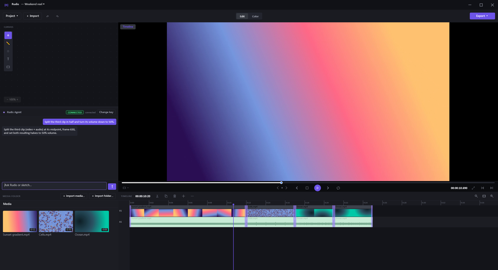

# Rudis

**A Windows video editor for people who have never edited a video.**

[](https://github.com/aaasocial/rudis-app/releases/latest)
[](LICENSE)




Import a video, cut it on a timeline, fix the sound, and export a real file. Every edit works on
the actual video data, so what you see in the preview is what you get on disk. If you want help,
an optional in-app agent and a Canvas (a whiteboard you sketch on) drive the same timeline as the
standard tools.

- **Edit:** trim, split and rearrange clips on a timeline, with a preview of real decoded frames.
- **Audio:** change clip volume, or detach the audio from its video.
- **Export:** H.264/HEVC through your GPU's hardware encoder or Windows Media Foundation.
- **Offline by default:** import, edit and export need no account, no key and no network.
- **Optional AI:** an agent (Anthropic) and generation (Runway) with your own API keys;
  offline transcription for remove-words editing and subtitles.

Rudis is a native WinUI 3 app over a Rust engine, with an LGPL build of FFmpeg run as a separate
process. It runs on Windows only and is tested on Windows 10/11 x64.

**[Download](#download-and-install)** · [Build from source](#build-from-source) ·
[API keys](#api-keys-optional) · [Troubleshooting](#troubleshooting) · [Licence](#licence)

## Download and install

1. Open the [latest release](https://github.com/aaasocial/rudis-app/releases/latest) and download
   `Rudis-win-Setup.exe`.
2. Run it. Windows SmartScreen shows **"Windows protected your PC"** because the installer is not
   code-signed (see below). Click **More info**, then **Run anyway**.
3. Rudis installs for your user only, with no administrator rights, and starts.

To uninstall, use *Apps & features* (the entry is named `Rudis`).

Each release carries:

| Asset | What it is |
|-------|------------|
| `Rudis-win-Setup.exe` | The installer. Per-user (`%LOCALAPPDATA%\Rudis`), no administrator rights; it adds an *Apps & features* entry named `Rudis` for uninstalling. |
| `Rudis-win-Portable.zip` | The same app without an installer: unzip anywhere and run `Rudis.exe`. |
| `SHA256SUMS.txt` | One line per file above: its SHA-256 hash and its name, in `sha256sum` format. |

### Why the SmartScreen warning

Rudis is open source and has no paid code-signing certificate. The warning is about the missing
signature, not about what the installer does. A free open-source signing programme such as
SignPath Foundation is a possible future option; nothing is planned.

### Verify your download

Compare each file's hash with its line in `SHA256SUMS.txt` from the same release. In Windows
PowerShell, in the folder you downloaded to:

```powershell
Get-FileHash .\Rudis-win-Setup.exe -Algorithm SHA256
```

The `Hash` it prints must equal, ignoring letter case, the first field of the `Rudis-win-Setup.exe`
line in `SHA256SUMS.txt`. In Git Bash or WSL, with the downloads and `SHA256SUMS.txt` in one folder,
`sha256sum -c SHA256SUMS.txt` checks every file at once.

A matching hash proves the file arrived intact and is the one the release lists. It does not prove
who built it: `SHA256SUMS.txt` is published next to the files it describes, so whoever could replace
one could replace both. **Building from source is the fully trusted route.**

## API keys (optional)

The editor works fully with no key at all. Two optional features take keys: the **agent**
(Anthropic, keys from [console.anthropic.com](https://console.anthropic.com)) and **generation**
(Runway, keys from [dev.runwayml.com](https://dev.runwayml.com)).

- **Where to enter them:** **Settings**, opened from the TitleBar app-glyph menu -> *Settings...*,
  with `Ctrl+,`, or with the key button in the Chat panel. Save, Replace and Clear take effect
  immediately; no restart.
- **Where they are kept:** **Windows Credential Manager**, under the targets
  `anthropic-api-key.rudis` and `gen-runway-api-key.rudis`.
- **Is it working:** the Chat panel shows `connected` or `unavailable — <why>`.

<details>
<summary>Environment variables, <code>.env</code> and ElevenLabs</summary>

- Precedence: Credential Manager first, then the process environment (`ANTHROPIC_API_KEY`;
  `RUNWAY_API_KEY`, falling back to `RUNWAYML_API_SECRET`; `ELEVENLABS_API_KEY`), then none.
- A `.env` file in the repository root (or beside the exe) is a **developer convenience**: the app
  loads it at startup only for variables that are not already set. `dotnet publish` never
  includes it (only the optional shortcut script in *Build from source* places it beside the exe).
  `RUDIS_NO_DOTENV=1` disables it.
- ElevenLabs (voice) has no Settings UI; set `ELEVENLABS_API_KEY` (environment or `.env`). A
  `gen-elevenlabs-api-key.rudis` Credential Manager entry, if present, takes precedence over it.

</details>

## Where your files live

| What | Where |
|------|-------|
| Projects | `%APPDATA%\app.rudis.desktop\projects` |
| Caches | `%LOCALAPPDATA%\app.rudis.desktop` |
| Installed app | `%LOCALAPPDATA%\Rudis` |

## Build from source

Building from source is for contributors, and for anyone who wants a binary they built themselves.
Steps 1–4 are run top to bottom in **Windows PowerShell** from the repository root; every block is
copy-paste and none is optional.

### Prerequisites

Install these by hand. Step 1 checks each one and fails by name if one is missing.

| Tool | Version | Why |
|------|---------|-----|
| Windows | Windows 10 1809+ or Windows 11, x64, with a **D3D12-capable GPU** | The preview and hardware decode run on the GPU through Direct3D 12 |
| [**Git**](https://git-scm.com) | any recent | Clone the repository |
| [**Visual Studio 2022 Build Tools**](https://visualstudio.microsoft.com/downloads/) | *Desktop development with C++* workload (MSVC v143 + a Windows 10/11 SDK) | rustc's linker and the C parts of the Rust build need them; the Community/Professional editions with the same workload also work |
| [**.NET SDK**](https://dotnet.microsoft.com/download/dotnet/9.0) | **9.0.316 or any later 9.0 SDK** (a later 9.0.3xx, or a later feature band such as 9.0.4xx) | Builds the WinUI 3 shell; `global.json` pins 9.0.316 with `rollForward: latestFeature` |
| [**Rust (stable) via rustup**](https://rustup.rs) | `stable` (`rust-toolchain.toml`); last verified with rustc 1.96.1 | Builds the engine and the native library the shell loads |

You also need about 10 GB of free disk and a network connection for the build (crates.io, NuGet,
and the three pinned downloads below). Clone to a SHORT path such as `C:\src\Rudis`: Windows'
260-character path limit bites deep build trees.

```text
git clone https://github.com/aaasocial/rudis-app.git Rudis
cd Rudis
```

### 1. Check the prerequisites

```powershell
git --version
dotnet --version
cargo --version
rustc --version
$vs = & "${env:ProgramFiles(x86)}\Microsoft Visual Studio\Installer\vswhere.exe" -latest -products * -requires Microsoft.VisualStudio.Component.VC.Tools.x86.x64 -property installationPath
if (-not $vs) { throw 'Visual Studio 2022 Build Tools with the "Desktop development with C++" workload was not found' }
Write-Host "MSVC toolchain: $vs"
```

What a failure of each line means:

- `git --version` fails: Git is not installed or not on `PATH`.
- `dotnet --version` fails inside the clone: no .NET SDK at 9.0.316 or later within 9.0 is installed (`global.json` requires one; an older 9.0 SDK or a different major version such as 8.0 or 10.0 is not enough).
- `cargo --version` / `rustc --version` fail: Rust is not installed through rustup, or a new terminal is needed after installing it.
- The `vswhere.exe` line fails, or the next line throws: Visual Studio 2022 (or its Build Tools) is missing, or it lacks the *Desktop development with C++* workload.

### 2. Fetch the pinned payloads

Three downloads, about 175 MB in total. Each is SHA256-pinned by its script: the scripts refuse a
file whose hash does not match and refuse a GPL build of FFmpeg. Run them as-is; do not pass
alternative URLs or hashes.

```powershell
powershell -NoProfile -ExecutionPolicy Bypass -File scripts\windows\fetch-libclang18.ps1
powershell -NoProfile -ExecutionPolicy Bypass -File scripts\windows\fetch-ffmpeg-devlibs.ps1
powershell -NoProfile -ExecutionPolicy Bypass -File scripts\windows\fetch-lgpl-ffmpeg.ps1
```

| Script | Installs | Into | Used for |
|--------|----------|------|----------|
| `fetch-libclang18.ps1` | libclang 18.1.1 | `crates\engine\libclang\` | The Rust build's bindgen; without it the build stops and names this script |
| `fetch-ffmpeg-devlibs.ps1` | FFmpeg 8.0.1 LGPL development libraries | `crates\engine\ffmpeg-dev\` | Linked by the hardware-decode preview path |
| `fetch-lgpl-ffmpeg.ps1` | The LGPL FFmpeg sidecar (`ffmpeg.exe`, `ffprobe.exe` and their DLLs) | `runtime\binaries\` | What the app runs for decode, encode and export; published beside the exe |

**Optional features.** Two more fetches are not part of the build. Without them, the features
they enable report themselves unavailable and everything else works. Both are hundreds of MB. Run
them now, before step 3, or re-run step 3 afterwards, because publish copies `runtime\binaries`
into `dist\Rudis\binaries`.

```text
powershell -NoProfile -ExecutionPolicy Bypass -File scripts\windows\fetch-whisper-cli.ps1
powershell -NoProfile -ExecutionPolicy Bypass -File scripts\windows\fetch-opencv-sdk.ps1
```

- `fetch-whisper-cli.ps1` installs whisper-cli and the ggml-small model: offline transcription,
  remove-words editing and subtitles.
- `fetch-opencv-sdk.ps1` installs the OpenCV sidecar (an embeddable Python with OpenCV): motion
  tracking.

### 3. Build and publish

This compiles the Rust workspace too (the project files invoke cargo), restores NuGet packages, and
publishes a self-contained app into `dist\Rudis` inside the clone. A cold build takes tens of
minutes and downloads every crate once.

Why publish and not build: only `dotnet publish` stages the FFmpeg sidecar beside the exe. A plain
`dotnet build` output has none, and the engine would fall back to whatever `ffmpeg` is on `PATH`
(or find none).

```powershell
dotnet publish shell\Rudis.Shell\Rudis.Shell.csproj -c Release -p:Platform=x64 -o dist\Rudis
```

### 4. Run it

```powershell
Start-Process -FilePath .\dist\Rudis\Rudis.Shell.exe
```

From then on, launch `dist\Rudis\Rudis.Shell.exe` directly. After pulling changes, re-run step 3.

**Optional desktop shortcut.** This script publishes the app and creates a desktop shortcut:

```text
powershell -NoProfile -ExecutionPolicy Bypass -File scripts\windows\install-desktop-shortcut.ps1
```

> [!WARNING]
> It also links your repository `.env` (which may hold plaintext API keys) into `dist\Rudis`
> beside the exe, as a hardlink, or as a copy if a hardlink is not possible. Do not zip or share
> `dist\Rudis` as-is after running it.

## Troubleshooting

| Symptom | Cause and fix |
|---------|---------------|
| SmartScreen says **"Windows protected your PC"** | The binaries are not code-signed. Click **More info** -> **Run anyway**; see [Verify your download](#verify-your-download). |
| No window, or a black preview | The GPU must support Direct3D 12. |
| The app exits immediately with code `-1073741189` and no window | The publish is incomplete (a missing `Rudis.Shell.pri` or native DLLs). Re-run step 3. |
| `fetch-lgpl-ffmpeg.ps1` fails with 404 | It downloads a pinned release from a GitHub fork of FFmpeg-Builds; a 404 means the pinned release moved. Open an issue; do not point the script elsewhere. |
| Path-too-long errors from cargo or MSBuild | Clone to a shorter path such as `C:\src\Rudis`. |
| `dotnet --version` errors inside the clone | Install .NET SDK 9.0.316 or any later 9.0 SDK. |

## Known limitations

- Windows only (10 1809+ or 11, x64, Direct3D 12 GPU).
- The release binaries are not code-signed, so Windows SmartScreen warns on the first run of each
  new release. See [Download and install](#download-and-install) for the *More info* -> *Run
  anyway* path and how to verify the download.

Found a bug? [Open an issue](https://github.com/aaasocial/rudis-app/issues).

## Licence

Rudis is **AGPL-3.0-only**. [`LICENSE`](LICENSE) is the verbatim FSF text;
[`NOTICE.md`](NOTICE.md) carries the notices, including that using Rudis for paid work is
unrestricted (what the AGPL governs is distributing modified Rudis).
[`THIRD-PARTY-LICENSES.md`](THIRD-PARTY-LICENSES.md) records every third-party part.

FFmpeg is an **LGPL v3** build run as a separate sidecar process, never a GPL build. H.264/HEVC
export uses hardware / Windows Media Foundation encoders.
